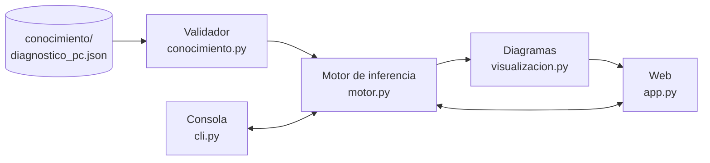

# Arquitectura

Cómo está construido el sistema experto por dentro. Para usarlo, ver el [README](../readme.md).

## Los 5 componentes

### 1. Base de Conocimiento — `conocimiento/diagnostico_pc.json`

Vive en un archivo JSON, separado del código, con dos partes:

- **`hechos`**: lo que se le pregunta al usuario. Cada hecho tiene su pregunta y un tipo de respuesta: sí/no (por defecto), opción múltiple o número.
- **`reglas`**: "SI estas condiciones ENTONCES este hecho". Cada condición depende del tipo del hecho: `true`/`false`, una opción (`"laptop"`), una lista de opciones (`["ninguno", "uno_corto"]`) o un rango numérico (`{">=": 90}`). Las reglas que tienen `recomendacion` son diagnósticos finales; las que no la tienen producen **hechos intermedios** que usan otras reglas.

```json
{
  "id": "R02",
  "descripcion": "Falla de RAM",
  "si": { "arranque_sin_video": true, "patron_pitidos": "repetidos" },
  "entonces": "falla_ram",
  "recomendacion": "Probar con módulos de RAM de a uno",
  "confianza": 0.88
}
```

Al cargarse, `conocimiento.py` valida el archivo y reporta todos los errores juntos:
- condiciones sin pregunta ni regla que las produzca,
- IDs duplicados y campos desconocidos,
- reglas con condiciones idénticas,
- confianza fuera de rango,
- dependencias circulares,
- preguntas que ninguna regla usa.

El formato completo, con el campo opcional `advertencia`, está en la [guía de conocimiento](conocimiento.md).

### 2. Base de Hechos — `BaseDeHechos` en `modelo.py`

Guarda para cada hecho su valor (verdadero, falso o desconocido), su certeza y qué lo originó: el usuario o una regla. Se crea nueva en cada consulta, así que una consulta nunca contamina a la siguiente.

### 3. Motor de Inferencia — `motor.py`

- `equiparar()`: devuelve las reglas cuyas condiciones se cumplen y que todavía no se dispararon.
- `resolver_conflictos()`: elige la de mayor confianza y, si hay empate, la más específica.
- `encadenar_hacia_adelante()`: repite el ciclo *equiparar → resolver → disparar* hasta que ninguna regla nueva aplica. Cada conclusión se agrega a la base de hechos y puede activar otras reglas. La certeza se propaga por la cadena: `confianza de la regla × certeza mínima de sus condiciones`.

El motor no imprime nada, solo devuelve datos. Por eso se puede testear y se podría conectar a una interfaz web sin cambiarlo.

### 4. Interfaz de Explicación

`Inferencia.justificacion()` reconstruye la cadena de reglas que llevó a un diagnóstico, y la consola la muestra ciclo por ciclo:

```
Ciclo 1: [I01] Arranca pero no muestra imagen
    SI enciende=sí, hay_video=no
    ENTONCES arranque_sin_video  (100%)
Ciclo 2: [R02] Falla de RAM
    SI arranque_sin_video=sí, pitidos_arranque=sí
    ENTONCES falla_ram  (88%)
```

### 5. Interfaz de Usuario — `cli.py`

Es la única parte que usa `input()` y `print()`. En cada paso le pide al motor la siguiente pregunta (`siguiente_pregunta()`), valida la respuesta y, cuando ya no queda nada útil por preguntar, ejecuta la inferencia.

#### Consulta dinámica

`siguiente_pregunta()` usa el encadenamiento hacia atrás en cada paso:

1. Analiza cada diagnóstico y descarta los que ya contradice alguna respuesta, igual que los ya confirmados.
2. Junta las preguntas que les faltan a los diagnósticos que siguen abiertos.
3. Elige la que necesitan más hipótesis a la vez. Si hay empate, prefiere la de mayor confianza y luego el orden del JSON.
4. Si no queda ninguna, termina la consulta.

Una prueba recorre todo el árbol de decisión (más de 10 000 caminos de consulta, con todas las opciones y los valores límite de cada umbral numérico). En cada final comprueba que las respuestas no preguntadas no habrían cambiado el resultado: preguntar menos nunca hace perder un diagnóstico.

Para que el motor sea rápido, antes de encadenar descarta una sola vez las reglas que ya contradicen alguna respuesta: como las respuestas no cambian durante la inferencia, esas reglas nunca podrían dispararse.

## Interfaz web y diagramas

- `app.py` es la segunda interfaz (Streamlit). Igual que `cli.py`, solo presenta: pide la siguiente pregunta al motor, muestra el diagnóstico, sus advertencias y la explicación.
- `visualizacion.py` genera los diagramas en formato DOT (Graphviz) de la cadena de razonamiento y de la red completa. Es Python puro, por eso se prueba sin Streamlit.


