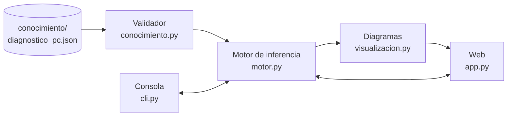

# Arquitectura

Cómo está construido el sistema experto por dentro. Para usarlo, ver el [README](../readme.md).

## Los 5 componentes

### 1. Base de Conocimiento — `conocimiento/diagnostico_pc.json`

Vive en un archivo JSON, separado del código, con dos partes:

- **`hechos`**: lo que se le pregunta al usuario. Cada hecho tiene su pregunta y un tipo de respuesta: sí/no (por defecto), opción múltiple o número.
- **`reglas`**: "SI estas condiciones ENTONCES este hecho". Cada condición depende del tipo del hecho: `true`/`false`, una opción (`"laptop"`), una lista de opciones (`["ninguno", "uno_corto"]`) o un rango numérico (`{">=": 90}`). Las reglas que tienen `recomendacion` son diagnósticos finales; las que no la tienen producen **hechos intermedios** que usan otras reglas.

```json
{
  "id": "R02",
  "descripcion": "Falla de RAM",
  "si": { "arranque_sin_video": true, "patron_pitidos": "repetidos" },
  "entonces": "falla_ram",
  "recomendacion": "Probar con módulos de RAM de a uno",
  "confianza": 0.88
}
```

Al cargarse, `conocimiento.py` valida el archivo y reporta todos los errores juntos:
- condiciones sin pregunta ni regla que las produzca,
- IDs duplicados y campos desconocidos,
- reglas con condiciones idénticas,
- confianza fuera de rango,
- dependencias circulares,
- preguntas que ninguna regla usa.

El formato completo, con el campo opcional `advertencia`, está en la [guía de conocimiento](conocimiento.md).

### 2. Base de Hechos — `BaseDeHechos` en `modelo.py`

Guarda para cada hecho su valor (verdadero, falso o desconocido), su certeza y qué lo originó: el usuario o una regla. Se crea nueva en cada consulta, así que una consulta nunca contamina a la siguiente.

### 3. Motor de Inferencia — `motor.py`

- `equiparar()`: devuelve las reglas cuyas condiciones se cumplen y que todavía no se dispararon.
- `resolver_conflictos()`: primero las reglas del **nivel** más bajo; dentro del nivel, la de mayor confianza absoluta y luego la más específica.
- `encadenar_hacia_adelante()`: repite el ciclo *equiparar → resolver → disparar* hasta que ninguna regla nueva aplica. Cada disparo suma **evidencia a favor o en contra** de su conclusión, y puede activar otras reglas. La certeza de un disparo es `confianza de la regla × certeza mínima de sus condiciones`; las evidencias sobre un mismo hecho se combinan con los factores de certeza de MYCIN, y el hecho queda establecido mientras su certeza neta supere 0.2.

**¿Por qué niveles?** Un hecho derivado tiene nivel 1 + el mayor nivel de los hechos de los que depende (las respuestas son nivel 0). Completar un nivel antes de pasar al siguiente garantiza que toda la evidencia sobre un hecho se reúna *antes* de usarlo en otra regla. Así el resultado es el mismo sin importar el orden de las reglas en el archivo (una prueba lo verifica mezclando las reglas al azar).

El motor no imprime nada, solo devuelve datos. Por eso se puede testear y se podría conectar a una interfaz web sin cambiarlo.

### 4. Interfaz de Explicación

`Inferencia.justificacion()` reconstruye la cadena de reglas que llevó a un diagnóstico, y la consola la muestra ciclo por ciclo:

```
Ciclo 1: [I01] Arranca pero no muestra imagen
    SI enciende=sí, hay_video=no
    ENTONCES arranque_sin_video  (100%)
Ciclo 2: [R02] Falla de RAM
    SI arranque_sin_video=sí, pitidos_arranque=sí
    ENTONCES falla_ram  (88%)
```

### 5. Interfaz de Usuario — `cli.py`

Es la única parte que usa `input()` y `print()`. En cada paso le pide al motor la siguiente pregunta (`siguiente_pregunta()`), valida la respuesta y, cuando ya no queda nada útil por preguntar, ejecuta la inferencia.

#### Consulta dinámica

`siguiente_pregunta()` usa el encadenamiento hacia atrás en cada paso:

1. Analiza cada diagnóstico y descarta los que ya contradice alguna respuesta, igual que los ya confirmados.
2. Junta las preguntas que les faltan a los diagnósticos que siguen abiertos.
3. Elige la que necesitan más hipótesis a la vez. Si hay empate, prefiere la de mayor confianza y luego el orden del JSON. Las **pruebas de verificación** (`"prueba": true`) quedan para el final: solo se proponen cuando ya no quedan síntomas por preguntar.
4. Si no queda ninguna, termina la consulta.

**Solo pregunta lo que todavía puede cambiar el resultado.** Para cada diagnóstico calcula una **cota de certeza**: combina la evidencia que ya se disparó con toda la evidencia a favor que las preguntas pendientes todavía pueden activar (a la confianza máxima de cada regla), y supone que no llegará más evidencia en contra. Si esa cota no supera el umbral, ninguna respuesta puede establecer el diagnóstico y el motor deja de preguntar por él, tanto por sus síntomas como por su evidencia. Las preguntas respondidas con "no sé" no cuentan como pendientes.

Por ejemplo: si el equipo no enciende, tiene luz en la placa y **al puentear los pines del botón arranca**, la placa madre recibe −0,95. Aunque la prueba con otra fuente le sumara 0,7, quedaría en −0,83, así que el sistema ya no pide esa prueba ni la del enchufe: el diagnóstico (botón de encendido, 96 %) no puede cambiar.

La cota es segura porque cada evidencia a favor solo puede subir la certeza (fórmula de MYCIN) y la que está en contra, una vez disparada, no desaparece. Una prueba basada en propiedades lo comprueba: con miles de subconjuntos de respuestas al azar, ningún diagnóstico que el equipo completo termine estableciendo queda fuera de los alcanzables.

**Diagnóstico diferencial.** Si hay diagnósticos a menos de 20 puntos del principal (`MARGEN_DIFERENCIAL`), por ejemplo sobrecalentamiento al 90 % y driver o RAM al 87 %, el motor simula cada respuesta posible de cada pregunta disponible y mide cuánto puede cambiar la distancia entre cada par de rivales. Primero va la que más los separa, y la interfaz lo indica ("⚖️ Diagnóstico diferencial"). Los síntomas se siguen preguntando antes que las pruebas: el diferencial ordena las preguntas dentro de cada grupo y no hace que una prueba física se adelante a un síntoma.

Una prueba basada en propiedades verifica que preguntar menos nunca hace perder un diagnóstico: genera miles de equipos al azar (con semilla fija, para que sea reproducible), con todas las opciones y un valor por cada región de los umbrales numéricos, y comprueba que la consulta dinámica llega a los mismos diagnósticos que preguntar todo.

Hasta la versión 1.7 esa prueba recorría el árbol de decisión completo. Con 29 preguntas las combinaciones posibles superan los 4000 millones y crecen con cada pregunta nueva: recorrerlas todas dejó de ser viable (explosión combinatoria). El muestreo mantiene el tiempo constante al ampliar el conocimiento, y los casos de referencia cubren los caminos específicos importantes.

Para que el motor sea rápido, antes de encadenar descarta una sola vez las reglas que ya contradicen alguna respuesta: como las respuestas no cambian durante la inferencia, esas reglas nunca podrían dispararse.

## Interfaz web y diagramas

- `app.py` es la segunda interfaz (Streamlit). Igual que `cli.py`, solo presenta: pide la siguiente pregunta al motor, muestra el diagnóstico, sus advertencias y la explicación.
- `visualizacion.py` genera los diagramas en formato DOT (Graphviz) de la cadena de razonamiento y de la red completa. Es Python puro, por eso se prueba sin Streamlit.


```mermaid
flowchart LR
    JSON[("conocimiento/<br>diagnostico_pc.json")] --> V["Validador<br>conocimiento.py"]
    V --> M["Motor de inferencia<br>motor.py"]
    CLI["Consola<br>cli.py"] <--> M
    WEB["Web<br>app.py"] <--> M
    M --> VIZ["Diagramas<br>visualizacion.py"] --> WEB
```
