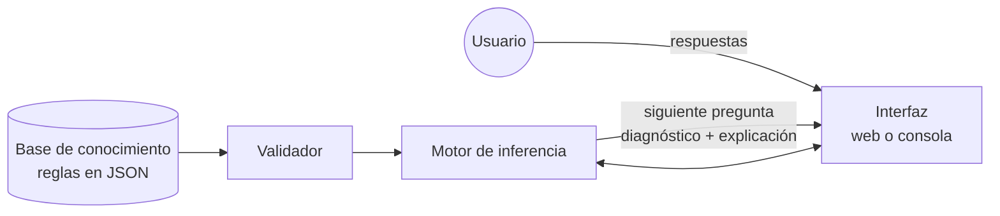

# Sistema Experto: Diagnóstico de PC 🖥️

[](https://github.com/MariaJoseMontepequeZet/sistema_experto_maria-montepeque/actions/workflows/tests.yml)


[](LICENSE)
[](https://diagnostico-pc-sistema-experto.streamlit.app/)

> 🚀 **Pruébalo en línea, sin instalar nada:** https://diagnostico-pc-sistema-experto.streamlit.app/
>
> Responde unas pocas preguntas sobre tu computadora y el sistema experto te dice qué puede estar fallando, qué hacer y **por qué** llegó a esa conclusión, con el diagrama de su razonamiento.

Un **sistema experto** basado en reglas que imita el razonamiento de un técnico de soporte: separa el
conocimiento (reglas en un archivo JSON que se puede editar sin programar) del **motor de inferencia**
que lo aplica. Nació como una [actividad académica](docs/actividad.md) y evolucionó hasta ser un
proyecto con arquitectura modular, pruebas automatizadas, integración continua y una demo pública.

## ✨ Características

- **Consulta dinámica:** solo pregunta lo que sirve para las hipótesis que siguen abiertas. Si el equipo no enciende, termina en 3 preguntas en lugar de 16.
- **Tres tipos de pregunta:** sí/no, opción múltiple (por ejemplo, el patrón de pitidos) y numéricas con unidad (por ejemplo, la temperatura del procesador).
- **Explica su razonamiento:** muestra la cadena de reglas que llevó al diagnóstico, en texto y como diagrama.
- **Encadenamiento hacia adelante y hacia atrás:** de los síntomas al diagnóstico, y de una hipótesis a los síntomas que la confirmarían.
- **Certeza por diagnóstico**, propagada a lo largo de la cadena y combinada con el modelo MYCIN cuando varias reglas coinciden.
- **Respuestas "no sé"** y la pregunta **"¿por qué me preguntas esto?"**.
- **Advertencias de seguridad** en los diagnósticos que implican abrir el equipo o arriesgar datos.
- **Conocimiento validado:** el archivo de reglas se revisa al cargarse y cualquier error se reporta con un mensaje claro.
- **Dos interfaces sobre el mismo motor:** web (Streamlit) y consola (sin dependencias).

## 🚀 Cómo usarlo

Requiere Python 3.10 o superior.

### Interfaz web

La forma más rápida es la [demo en línea](https://diagnostico-pc-sistema-experto.streamlit.app/). Para ejecutarla en tu computadora:

```bash
pip install -r requirements.txt
```
```bash
streamlit run app.py
```

### Consola (sin dependencias)

```bash
python main.py
```

| Respuesta | Significado |
|---|---|
| `s` / `n` | sí / no |
| `ns` | no sé (el síntoma queda desconocido y no se vuelve a preguntar) |
| `?` | ¿por qué me preguntas esto? |

Opciones: `--completo` hace todas las preguntas en orden, `--conocimiento archivo.json` usa otra base
de conocimiento y `--salida archivo.json` indica dónde exportar la red de inferencia.

## 🧠 Cómo funciona



1. El **validador** carga las reglas y verifica que sean consistentes.
2. En cada paso, el motor usa **encadenamiento hacia atrás** para elegir la pregunta que más hipótesis ayuda a confirmar o descartar.
3. Con las respuestas, el **encadenamiento hacia adelante** dispara reglas hasta no poder deducir nada nuevo; las conclusiones intermedias alimentan a otras reglas.
4. La interfaz muestra los diagnósticos ordenados por certeza, sus advertencias y la cadena de razonamiento.

Una prueba recorre el **árbol de decisión completo** (más de 10 000 caminos posibles de consulta) y, en
cada final, comprueba que las respuestas no preguntadas no habrían cambiado el resultado: preguntar
solo lo relevante nunca hace perder un diagnóstico.

📖 Más detalle en [Arquitectura](docs/arquitectura.md).

## 📁 Estructura

```
conocimiento/diagnostico_pc.json   reglas y preguntas (se editan sin programar)
sistema_experto/
  modelo.py          Regla, BaseDeConocimiento, BaseDeHechos
  conocimiento.py    carga y validación del JSON
  motor.py           encadenamiento hacia adelante / atrás, consulta dinámica
  visualizacion.py   diagramas Graphviz del razonamiento
  cli.py             interfaz de consola
app.py               interfaz web (Streamlit)
main.py              punto de entrada de la consola
tests/               pruebas unitarias, exhaustivas y de la interfaz web
docs/                arquitectura, guía de conocimiento y actividad original
```

## 🛠️ Desarrollo

```bash
python -m unittest -v
```

El CI de GitHub Actions ejecuta en cada Pull Request:
- `ruff` para revisar el estilo del código;
- las pruebas del motor en Python 3.10, 3.12 y 3.14, sin dependencias;
- las pruebas de la interfaz web, con Streamlit.

- ¿Quieres agregar o corregir un diagnóstico? Lee la [guía para escribir reglas](docs/conocimiento.md).
- Flujo de ramas y convención de commits: [CONTRIBUTING.md](CONTRIBUTING.md).
- Historial de versiones: [CHANGELOG.md](CHANGELOG.md).

## ⚠️ Aviso

Este sistema **orienta, no reemplaza a un técnico**. Antes de abrir el equipo, apágalo y desconéctalo
de la corriente. Nunca abras una fuente de poder: sus componentes guardan carga eléctrica peligrosa
aunque esté desconectada.

## 📄 Licencia

[MIT](LICENSE) © 2026 María José Montepeque
